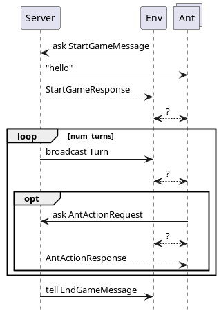

# AOT Gridworld Exercise with JIAC VI
In this module, we are using JIAC VI to set up a simple gridworld. The Server agent as well as all messages sent and received by it will be provided by us (TUB) and the students will have to implement the Environment and Ant agents and all interactions between them.

You need to have Maven and Java (jdk) installed to build the project and download dependencies. JIAC VI is implemented in Kotlin, but you can also use Java, however we strongly suggest Kotlin as the Kotlin-specific DSL is much easier to use. For an IDE with good Kotlin support we suggest using IntelliJ, others work well too.


## Overview of Provided Code

The code is using the JIAC VI agent framework developed by DAI-Labor.

* `pom.xml` is the Maven project description, defining the dependencies and where to find them
* `Main.kt` is used for configuring and starting the `ServerAgent.kt` and `EnvironmentAgent.kt`
* `ServerAgent.kt` defines the server side of the interaction; it will be explained in more detail below
* `Messages.kt` contains all the messages exchanged between the Server and the Client (i.e. Environment and Ants) according to the protocol; you can add additional messages for the communication between the Environment and Ants in a separate module, but the given messages must _not_ be changed or communication with the Server will not work
* `Models.kt` contains classes describing concepts in the Grid World; those are used by the Server to keep track of the current state of the game and its entities, but you can use the same classes in your agents, as well; note that some model classes are also used as part of messages (e.g. `Food` and `Ant`) and like the messages themselves should _not_ be altered or communication with the official Server will not work
* `EnvironmentAgent.kt` and `AntAgent.kt` defines a simple stub that you can use as a starting point for your implementation

Most of the code is written in Kotlin, but it is fully compatible with Java, you can use Java libraries, classes and methods written in Java. If you are not familiar with Kotlin, you may also use Java for the decision logic and Kotlin only for the high-level reactive behavior of the agent.


## Interaction between Server and Client

The following sequence diagram shows the messages exchanged between (i) the Server and the Env and Ants, and (ii) between the Env and its Ants. The latter has to be implemented by you, thus there are no concrete messages shown. 



The following messages are exchanged between the Server and the Env and Ants.

* the game is initialized by the Environment with a `StartGameMessage`, including IDs of the Ants that should be registered.
* the Server sends each registered Ant a "hello" message.
* the Server replies with a `StartGameResponse` holding information about the game
* in each turn
    * the Server broadcasts a `GameTurnInform` with the current turn, you can use this to sync your Agents but don't have to.
    * an Ant can make an `AntActionRequest` which is either a direction to move, take food or drop food at the nest.
    * the server replies with an `AntActionResponse` which is a Boolean (`true` or `false`), as well as flag with details. To see the flags and their meaning check the comments in Model.kt
      * If an ant moves successful and the new position is an active food source, the flag is set to `HAS_FOOD`.
* finally, the Server sends an `EndGameMessage` to the Env informing them about the outcome of the game


Also note that:
* at most 40 Ants are allowed. You can use less.
* ants are limited to one action per turn
* grid file names should be relative to the class path root
* obstacles will not be revealed at the start of the game


## Scoring

At the end of the game, the score of your Env will be calculated as the percentage of collected food from the total amount of food available in the grid. Ants still holding food does not count as collected.
```
    sum(value for f in foodSources)/nest.food * 100.0
```


## The Server

The `ServerAgent` is the agent running on the server side. You can look at the code to get a better understanding what the server does, and maybe to deduce how certain things need to be done in JIAC, but you should _not_ alter the code. Remember that in the end your agents will run against a server agent hosted by us, using the original code, so any changes to the server may render your agents incompatible with our server!


## The Client

The `EnvironmentAgent` and `AntAgent` can be used as a starting point for your implementation. In theory, you could implement both roles in the same agent, but is not allowed in this exercise. Instead, you are creating one `EnvironmentAgent` and several `AntAgent`s with those beans.

Besides the beans, you may also need to create additional classes for further messages between the Environment and its Ants (only hinted in the sequence diagram), or further model elements for representing the state of the game from the Ant's perspective.  All new files belong in `*/myAgent/`. (Of course, you can also use the classes used by the Server, but as mentioned before, you should not modify those or your agents might not work any longer with a Server using the original classes.)


## Reactive Behaviour and Messaging in JIAC VI

The agent's main behaviour is defined by overwriting the `behaviour()` function, using a specific notation:

```kotlin
override fun behaviour() = act {
    every(Duration.ofSeconds(s)) {
        // called in regular intervals
    }
    on<MsgX> {
        // react to message send to agent with `ref tell MsgX(...)`
    }
    respond<MsgX, MsgY> {
        // respond to query sent by `ref invoke ask<MsgY>(MsgX(...)) { res -> ... }`
    }
    listen<MsgX>(topicX) {
        // react to broadcast message send over topicX
    }
}
```

Here, `ref` is a reference to another agent acquired with `val ref = system.resolve(name)`. Please refer to the server for more examples on how to use them. Of course, you do not have to put all the actual logic into those callback functions but can define more methods to be called. You can also look at the `jiac-vi-documentation.pdf`.


## Running the Game
To start the game locally simply run the `Main` module of this project. Remember to specify a gridfile in the `Main` and to initialize your `AntAgents`.

### Gamelogs
By default, the game state will not be saved to a logfile. You can turn logging on in the `Main` module and specify a single logfile if you don't wish to save each new game on its own (this might be useful to monitor the gridworld).

