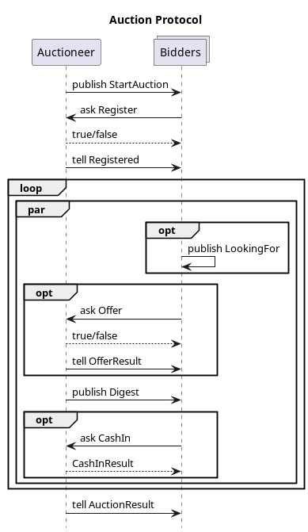

# AOT Auction Exercise with JIAC VI

In this module, we are using JIAC VI to set up a simple auction. The auctioneer side is already implemented,
along with a very simple example bidder agent. Your task is to implement a smarter bidder agent, buying and
selling items from other agents with the goal to achieve the highest score.

You need to have Maven and Java (jdk) installed to build the project and download dependencies. JIAC VI is implemented in Kotlin, but you can also use Java, however we strongly suggest Kotlin as the Kotlin-specific DSL is much easier to use. For an IDE with good Kotlin support we suggest using IntelliJ, others work well too.


## Files in the Repository

In the following, we will explain the main modules in this project:

* `pom.xml` - the Maven project description, defining the dependencies and where to find them
* `Main.kt` - setting up and starting the multi-agent system; add you agent(s) here
* `Model.kt` - defines the different messages exchanged between the auctioneer and bidders; you may add additional classes or methods, but don't change the defined messages, or the interaction with the auctioneer may fail
* `AuctioneerAgent.kt` - fully defines the auctioneer and thus the interaction with the bidder and all the rules; if you are unsure how things work, you can look here, but don't change it, or your bidder may no longer work with the regular unchanged auctioneer
* `DummyBidderAgent.kt` - a stub for the bidder agent, implementing the bidder agent's side of the interaction protocol, but with no bidding logic; you can use this as a starting point


## Interaction Protocol

The interaction protocol works as shown in the following figure, and as detailed below.




### Starting the Auction

* the auctioneer starts the auction, sending a `StartAuction` message to the `all-bidders` topic, including some information about the auction, e.g. the maximum number of turns
* bidder agents interesting in taking part respond with a `Register` message with their unique bidder ID; the auctioneer will respond with `true` if all went well or `false` if the bidder-ID was already taken
* in the second turn, the auctioneer sends a `Registered` message to all previously registered bidder agents, telling them their initial items and credits; this message will also include a `secret` random number that has to be included in all subsequent communication with the auctioneer in order to authenticate the bidder

### Making Offers/Bids

* bidder agents send `Offer` messages to the auctioneer, who responds with a `true` or `false` depending on whether the secret was correct and the price a non-negative number not higher than what the bidder currently possesses (also taking into account the bids of all currently pending previous offers)
* in regular intervals the auctioneer will handle the offers/bids sent to them by the bidder agents for the different item types, evaluate the different bids to determine who sells and who buys an item, and sending `OfferResult` messages to the respective bidders accordingly; the auctioneer will repeat the `secret` here so the bidder can check that the message is not coming from another bidder
* after each turn, the auctioneer will also send a `Digest` about last turn's results to all bidders, showing some statistics on offers made for the different item types

### Optional Activities

* at any time, bidder agents may send a `CashIn` message to the auctioneer, resulting in the given items being sold to the auctioneer, yielding as many credits as the same number of items would score at the end of the auction (provided that the bidders actually have the items that they want to sell)
* bidder agents may also send a `LookingFor` message to the `all-bidders` topic to indicate what items they are looking for and at what price; of course those might also be used for bluffing, and other agents can use them or ignore them

### Ending the Auction

* the auction ends once a set number of turns have passed in total or since the last offer (Note: During grading the number of turns may change, however it will be in the same category as given, i.e. never over 100)
* the auctioneer determines the winner and sends an `AuctionResult` message to each individual bidder

## The Auction

### Initial Wallet
In the beginning each bidder receives the same distribution of items, the distribution and which items one agent receives is random. In example all agents receive 3 times item X, however 1 might receive 3 times item 1 another agent receives 3 times item 2. You can check the `AuctioneerAgent.kt` for more. Here you can also change the initial credits.

### How Items are sold and bought

When sending an `Offer` there is no difference between selling and buying an item. In fact, the bidder itself does not know if the Item will be bought or sold, since it is defined only by the market value. Therefore, sending an `Offer` of 25 for item type 1 has a meaning of: bidder is willing to sell item 1 for 25 or buy item 1 for 25. Each turn all current offers will be evaluated and transferred accordingly.

For each item type a list of all `Offers` will be created. The market value (price) is calculated using median. All Bidders with `Offers` below median sell their item to Bidders above median, at market value. The bidder matching the median sells to himself. Examples for arbitrary item type:

- Offers: (0,4,9) => price = 4. bidder of offer 0 sells to bidder of offer 9 at price 4.
- Offers: (0,2,3,8) => price = 2.5. bidder of offers 0 and 2 are selling to bidders of offers 3 and 8 at price 2.5

### Short selling
It is possible to short sell items. Meaning it is possible to sell items the bidder does not actually possess. However, one needs to buy back these items otherwise a penalty at the end of the contest will be applied.

### Wallet value
The wallet value is calculated as sum of credits and value of owned items. Items of the same type (a collection) are rewarded according to the sum of fibonacci numbers matching the amount of items in that collection. The item type itself is not important. In example owning 4 items of same type results in 7.
```
fib_sum(4) = fib(0) + fib(1) + fib(2) + fib(3) + fib(4) = 0 + 1 + 1 + 2 + 3 = 7
```
```
score(Wallet(credits=15, item(type 1)=2, item(type 3)=4)) = 15 + 2 + 7 = 24
```
The penalty for not owning items is the negative collection value multiplied by 2. In example short selling an item 4 times without buying it back would be counted as -14 ```= fib_sum(4)*-2``` in the final score.

## Reactive Behaviour and Messaging in JIAC VI

The agent's main behaviour is defined by overwriting the `behaviour()` function, using a specific notation:

```kotlin
override fun behaviour() = act {
    every(Duration.ofSeconds(s)) {
        // called in regular intervals
    }
    on<MsgX> {
        // react to message sent to agent with `ref tell MsgX(...)`
    }
    respond<MsgX, MsgY> {
        // respond to query sent by `ref invoke ask<MsgY>(MsgX(...)) { res -> ... }`
    }
    listen<MsgX>("topic") {
        // react to message sent to topic with `broker.publish("topic", MsgX(...))
    }
}
```

Here, `ref` is a reference to another agent acquired with `val ref = system.resolve(name)`. Please refer
to the auctioneer and dummy bidder agents for more examples and how to use them, since they already make
use of all functions that you will need.

Of course, you do not have to put all the actual logic into those callback functions but can define more
methods to be called. Also, the auctioneer uses a `phase` and `turn` variable to keep track of what to do;
you may follow the same pattern, or try a different approach.


## General Hints and Advice

* when implementing the protocol, keep in mind that different methods of sending a message require different methods of receiving them on the other side, and vice versa (see section above)
* try to implement different bidding strategies, or different versions/revisions of the same, and let them bid against each other
* if you do, try to separate the bidding strategy part from the interaction protocol part of the agent's logic
* we decided against implementing proper security and authentication in the auctioneer (besides the simple `secret` number) in order to keep the setup simple; please be fair and refrain from sending fake auctioneer messages to other bidder agents!
* remember that each `Offer` is both an offer to _buy_ an item at the given price (or less), or to sell it at the given price (or more), depending on how much the other bidders offer
* the auctioneer will not check whether you actually have the item when offering/bidding for an item; you may use that to buy (or "sell") items that you currently don't own, but be aware that in the end, any items that you are missing (i.e. below zero) will count _twice_ against you
* when in doubt, please refer to the `AuctioneerAgent` code to see what exactly is allowed and what not
